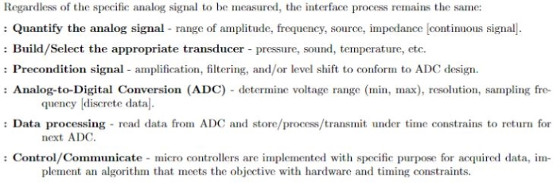
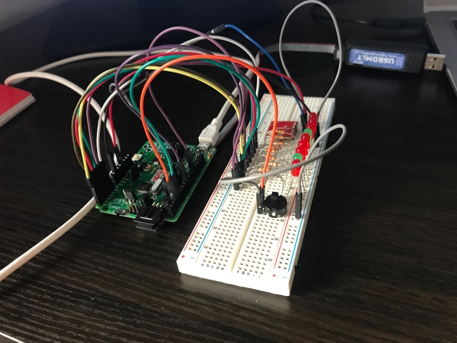
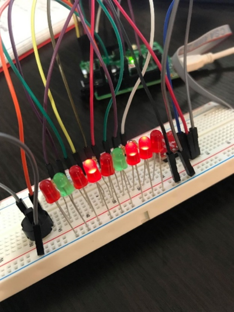
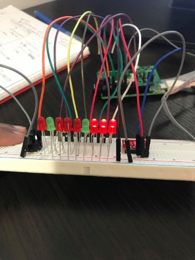
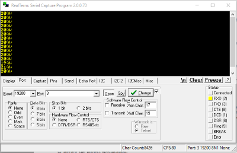
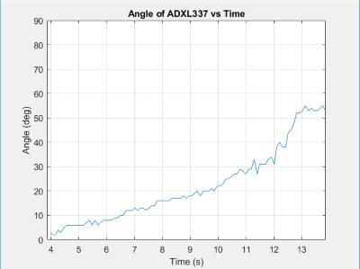

# Data Acquisition and Display: The Digital Inclination Angle Measurement System
Using a microcontroller and an accelerometer, a device capable of acquiring inclination angle measurement data between 0° and 90° is prototyped. This project was for the course Microprocessor Systems, and I received a mark of 94% on it. 

## Overview
The project specifications were as such:
  
This essentially meant that we were to use the tools at our disposal create a system that used the analog voltage from the accelerometer, convert that signal to digital (using Analog-to-Digital conversion) and display the angle in terms of binary coded decimal or number of led's turned on. The angle data is also serially communicated to a PC, so it can be displayed on MATLAB. The programming was done in C, and report was written in IEEE format.

## Hardware
- EsduinoXtreme HCS12GA240 microcontroller
- 1 AXDL337 breakout board (accelerometer)
- 9 LED lights (7 red, 2 green)
- 9 150Ω resistors
- 1 digital button
- A couple of wires

## Data & Display
- Serial Communication though USBDM interface (19200 baud rate, 8 bit data)
- Utilized Realterm Serial Capture to confirm data
- MATLAB to display the data in a clean, informative graph against time

## Future Improvements
- More compact
- Robust data storage
- Implementation on a larger scale (digital level, shipping crates, etc.)